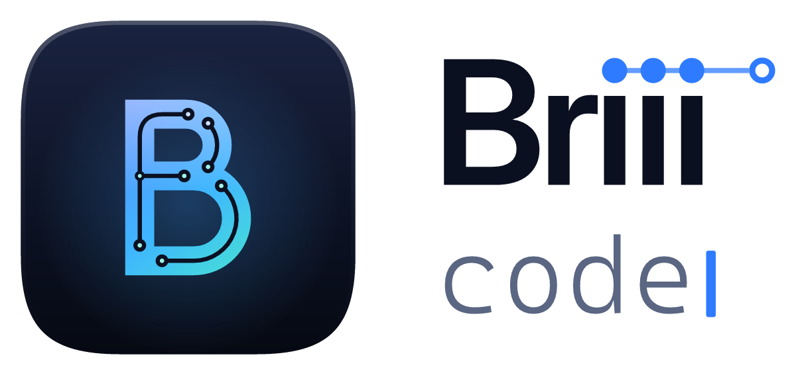

<p align="center">
  <picture>
    <source media="(prefers-color-scheme: dark)" srcset="brand/logo/logo-dark.png">
    
  </picture>
</p>

# Briii Code

A personal, branded build of VS Code for Windows. It repackages the official
[VSCodium](https://github.com/VSCodium/vscodium) release (VS Code's MIT-licensed source,
without Microsoft branding and telemetry) under the Briii Code name, and ships it as a
normal Windows installer. Everything VS Code does works the same way, online and offline.
Extensions come from [Open VSX](https://open-vsx.org).

## Build

Requirements: Node.js and Inno Setup 6 (`winget install --id JRSoftware.InnoSetup -e --scope user`).

```powershell
.\scripts\build.ps1                        # latest VSCodium release
.\scripts\build.ps1 -Version 1.135.06055   # a specific release
.\scripts\verify.ps1                       # smoke-test the newest installer in out\
```

The installer lands in `out\BriiiCode-Setup-x64-<version>.exe`. It installs just for you
(no admin prompt) by default, with Start menu entries, "Open with Briii Code" in Explorer,
the `briii` command on PATH (`briii .` opens a folder), and an uninstaller.

The installer is unsigned, so the first time you run it Windows SmartScreen shows
"Windows protected your PC". Click **More info → Run anyway**.

## What's built in

- **Apple look:** Briii Light and Briii Dark themes follow Windows' light/dark setting
  (`window.autoDetectColorScheme`). The Inter UI font, rounded controls, pill tabs and
  frosted popups come from `brand/ui/apple.css`.
- **GitHub:** Accounts (bottom left) → **Sign in with GitHub** for push/pull/clone. The
  bundled GitHub Pull Requests extension adds PRs and issues to the sidebar.
- **Vercel:** click **▲ Deploy** in the status bar, or run *Vercel: Deploy Preview* /
  *Vercel: Deploy to Production* from the Command Palette. The first run walks you through
  installing the Vercel CLI (`npm i -g vercel`), `vercel login` and `vercel link`. Deploy
  output is in the *Vercel* output panel.

## Customize

| File | What it controls |
|---|---|
| `brand/brand.json` | Name, CLI command, data folders, URL protocol. **Never change `ids`**, because Windows uses them to recognise upgrades. |
| `brand/icons/src/` | The icon artwork: `icon.svg` (full icon), `icon-small.svg` (16-24 px) and `glyph.svg` (the B alone). After editing, run `npm install` once, then `npm run icons`. That regenerates `brand/icons/` (`app.ico`, Start tiles, title-bar icon, watermark) and `brand/logo/` (wordmark and logo, dark and light). Commit the output. |
| `defaults/settings.json` | Default settings (plain JSON). Anything you set in the app still wins. |
| `defaults/extensions.txt` | Open VSX extensions bundled into the installer, so they work offline from first launch. |
| `brand/extensions/` | Briii's own built-in extensions: `briii-theme` (colours) and `briii-deploy` (Vercel). |
| `brand/ui/apple.css` | Shape, type and depth tweaks. They target VS Code internals, so check them after updating VSCodium. |

## Update

The built-in updater is turned off, because it would replace Briii Code with stock VSCodium.
When VSCodium ships a new release, rerun `build.ps1` and run the new installer. It
upgrades in place and keeps your settings and extensions.

## Extensions

- **Online:** the Extensions view searches Open VSX.
- **Offline:** Extensions view → `…` → **Install from VSIX…**, or `briii --install-extension file.vsix`.
- **Not available:** Microsoft-only extensions (Pylance, C# Dev Kit, Remote-SSH, Live Share,
  the MS C/C++ debugger) are licensed only for Microsoft's VS Code. Open alternatives include
  basedpyright, clangd and Open Remote SSH.

Your settings live in `%APPDATA%\Briii Code` and extensions in `~\.briii\extensions`,
separate from any VS Code install.
